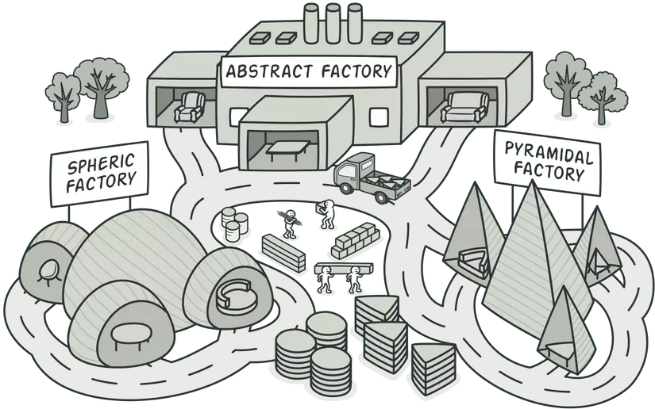
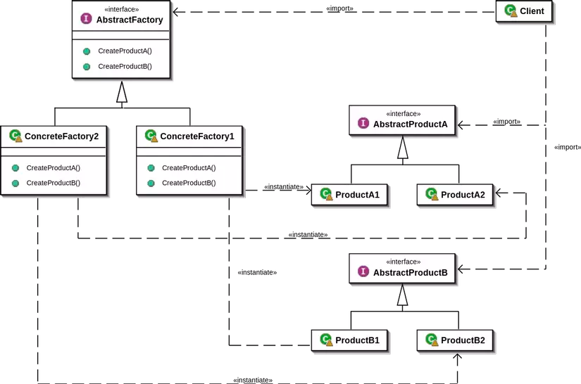

# Abstract Factory Pattern

Abstract Factory is a creational design pattern, which solves the problem of creating entire product families without specifying their concrete classes.
Abstract Factory defines an interface for creating all distinct products but leaves the actual product creation to concrete factory classes. Each factory type corresponds to a certain product variety.

The client code calls the creation methods of a factory object instead of creating products directly with a constructor call (new operator). Since a factory corresponds to a single product variant, all its products will be compatible.

Client code works with factories and products only through their abstract interfaces. This lets the client code work with any product variants, created by the factory object. You just create a new concrete factory class and pass it to the client code.

## Architecture
